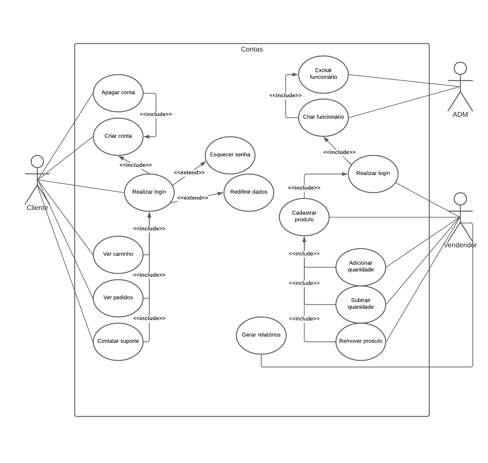
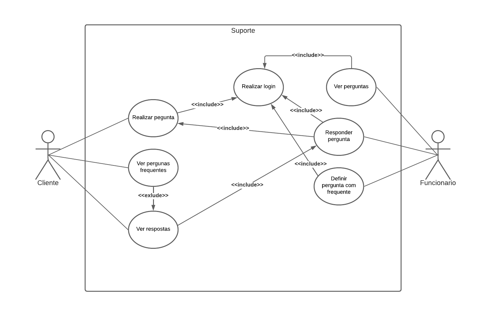

# Diagrama de Caso de Uso

- **Seleção de Casos de Uso:** para estre projeto, foram escolhidos 5 cenários para os diagramas de uso sendo eles:
    - Realizando compra
    - Contas
    - Pesquisando produtos
    - Suporte
    - Acompanhamento do produto
- **Critérios de Seleção:** cenários mais comuns em um sistema de loja virtual.
- **Descrição de Casos de Uso:** 
    - **Realizando compra**: detalha as opções do cliente ao realizar a compra de algum produto.
    - **Contas**: mostra as opções de conta que o cliente e os vendedores possuem.
    - **Pesquisando produtos**: mostrar as opções disponiveis ao usuário ao realizar uma pesquisa de produtos.
    - **Suporte**: mostra a opções do usuário ao contatar o suporte do sistema.
    - **Acompanhamento do produto**: detalha o acompanhamento do envio do produto feito pelo cliente e o vendedor.

# Cenários
- **Crie o Cenário:** Crie o cenário completo de ao menos 5 casos de uso. 
- Realizando compra

- Contas

- Pesquisando produtos

- Suporte

- Acompanhamento do produto
