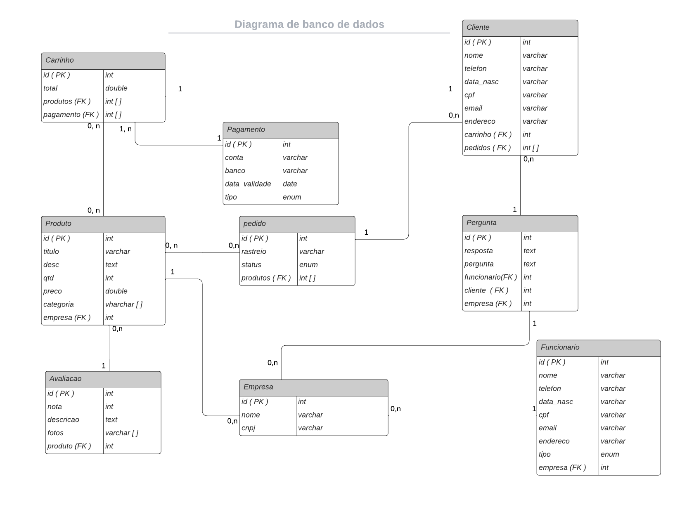

# Gerenciamento de Dados
### Estratégia de Armazenamento de Dados

O sistema StormTech adota uma abordagem robusta e eficiente para o armazenamento de dados, utilizando um banco de dados relacional para garantir consistência e confiabilidade. A estratégia de armazenamento de dados é projetada para atender aos requisitos específicos do sistema, proporcionando uma base sólida para operações eficazes e escalabilidade.

#### Estratégia Utilizada: Banco de Dados Relacional
- **Motivação:**
    - **Consistência e Integridade:** Bancos de dados relacionais oferecem um modelo de dados estruturado que facilita a manutenção da consistência e integridade dos dados.
    - **Suporte a Transações:** A capacidade de realizar transações garante que as operações sejam atomicamente executadas, contribuindo para a confiabilidade das operações.
    - **Modelagem Relacional:** A modelagem relacional permite representar relações complexas entre diferentes entidades, refletindo fielmente a lógica de negócios do StormTech.

#### Estratégias de Otimização:
- **Indexação Adequada:** Utilização eficiente de índices para acelerar operações de consulta e garantir um acesso mais rápido aos dados.
- **Normalização e Desnormalização Controlada:** Equilíbrio entre a normalização para evitar redundância e a desnormalização controlada para otimizar consultas frequentes.

# Gerenciamento de bancos de dados
- Banco de dados: Estrutura
