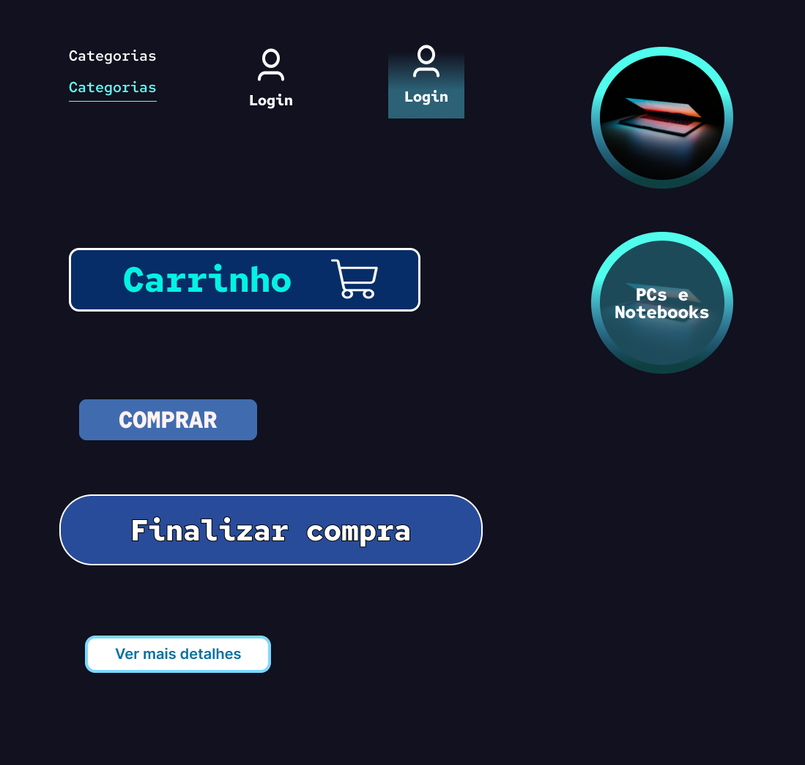

# Guia de Estilo

Este guia de estilo tem como função registrar as decisões de design relacionadas à implementação do projeto Storm Tech. Serve como uma ferramenta de comunicação entre a equipe de design e a equipe de desenvolvimento.

## Logo

Autores: Fabrício e Henrique 

## Paleta de Cores

A paleta de cores é composta por sete cores base, incluindo azul com trez tonalidades diferentes, preto, branco e roxo

## Tipografia

As fontes utilizadas na aplicação serão:

- Red Hat mono (Open Font License) para títulos.
- Rasa (Open Font License) para títulos.

## Botões

Os botões utilizados no menu de navegação tem cor branca e quando o ponteiro passa por cima fica com uma coloração azul e sublinhado. Outros botões tem uma certa semelhança com hover no entanto muda a coloração e tambem o formato.

