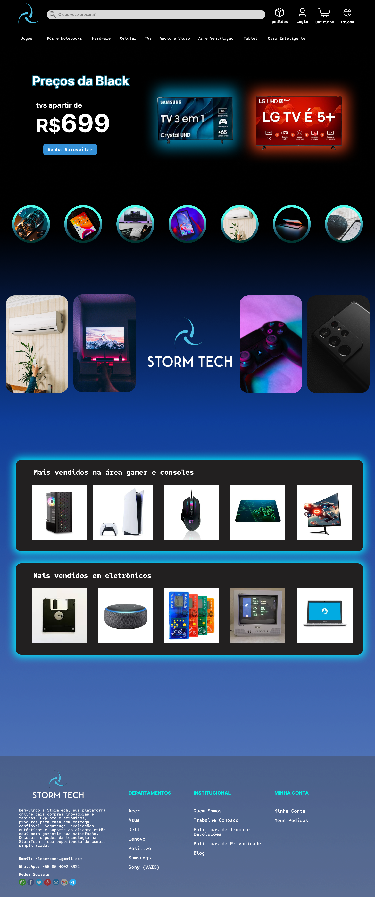
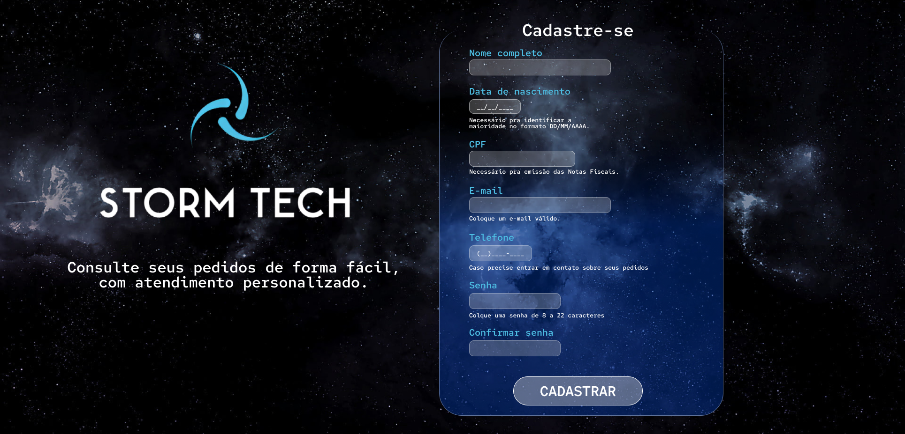
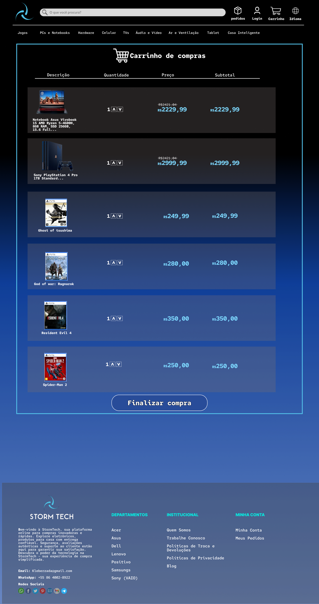
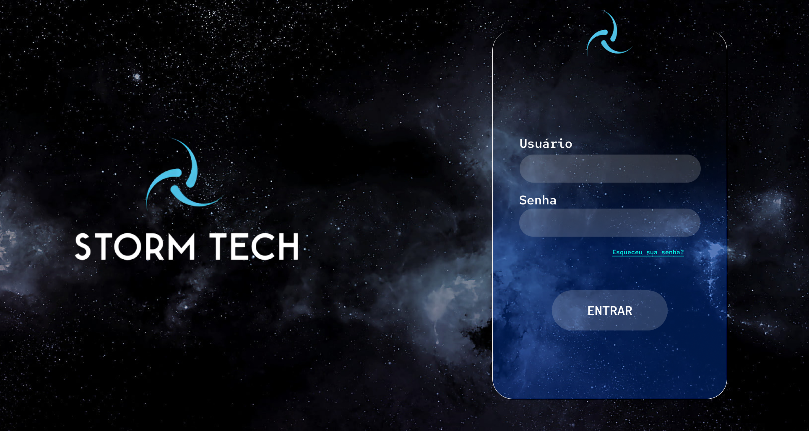
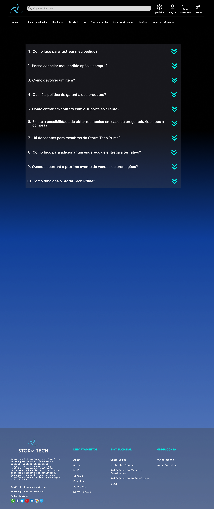
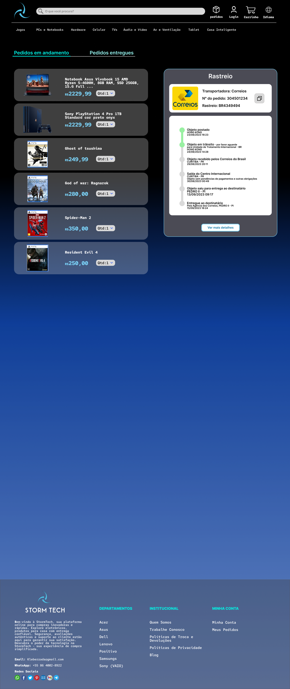
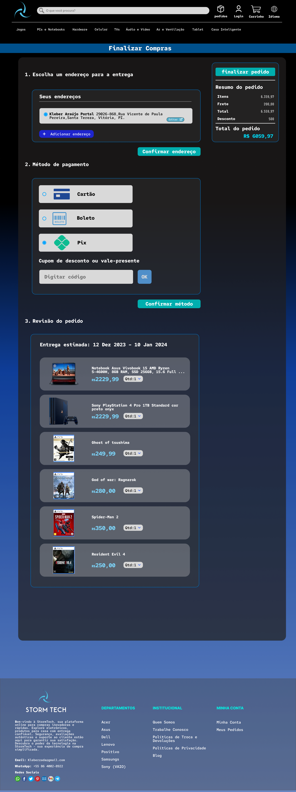
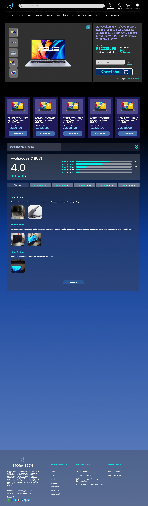

# Prototipação de Baixa Fidelidade
- [Inclua uma breve descrição dos primeiros esboços do projeto, (Opcional).]

# Vídeo do Protótipo
- [Insira um link ou anexe um vídeo que demonstre todas as funcionalidades e ações do protótipo.]

# Prototipação de Alta Fidelidade

## home

## Pcs e notebooks (catálogo)

## Cadastro

## Jogos

## Carrinho

## Logui

## FAQ

## Pedidos

## Compra

## Produtos

