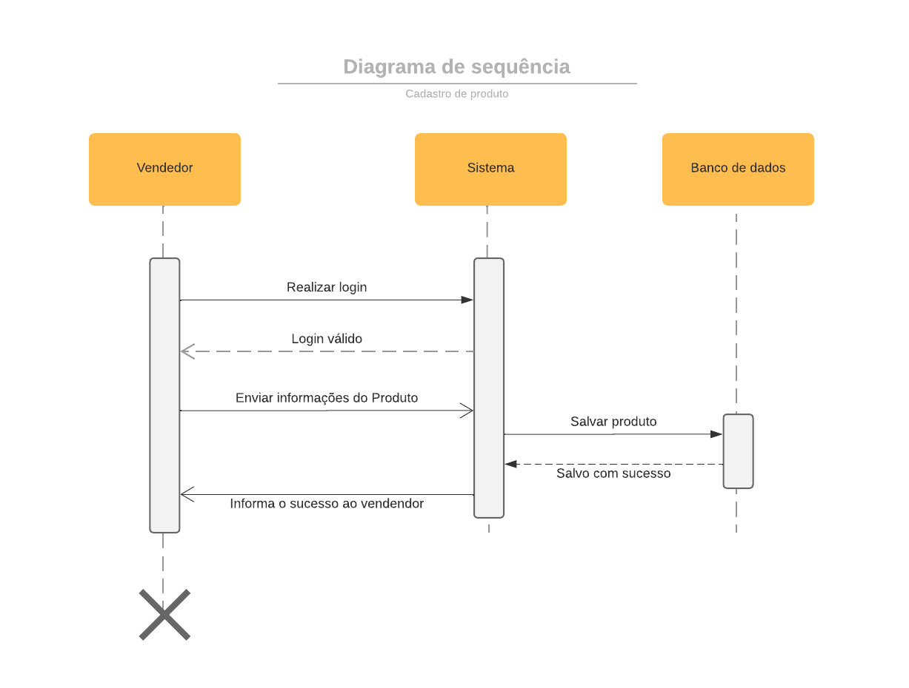
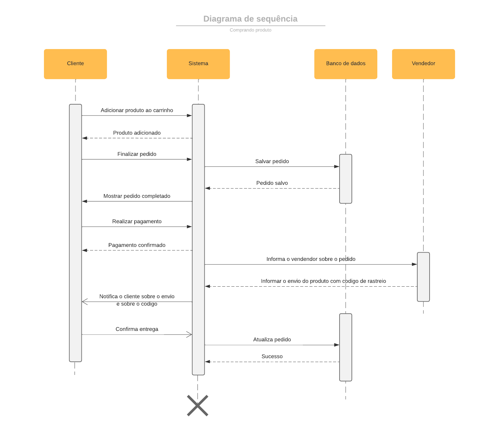
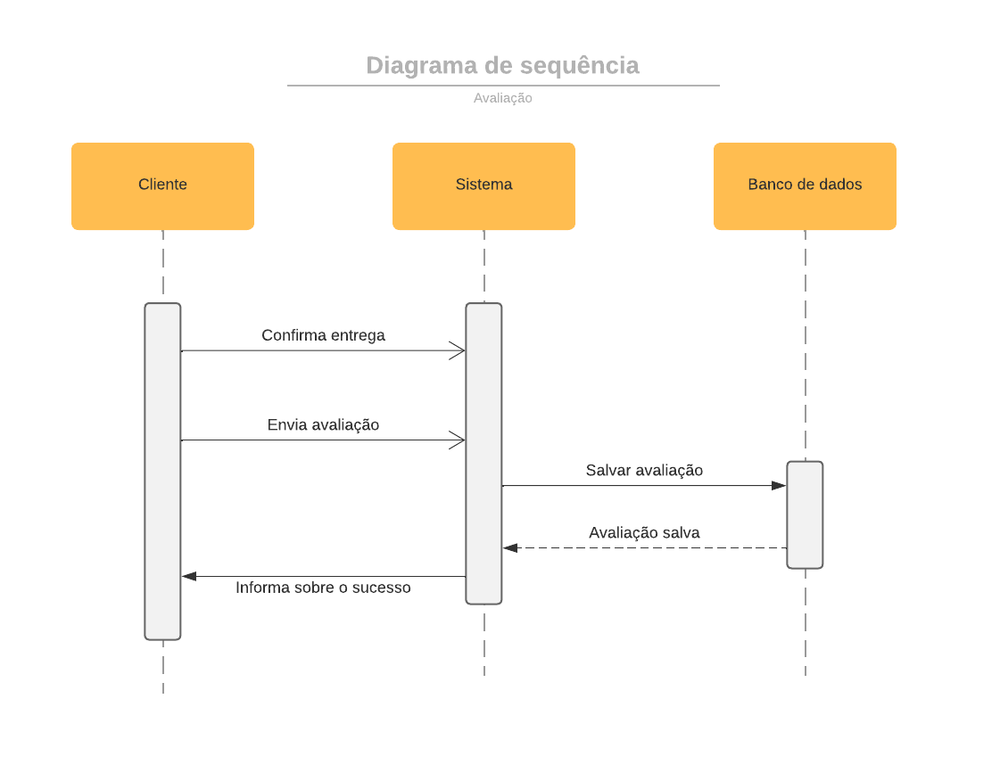
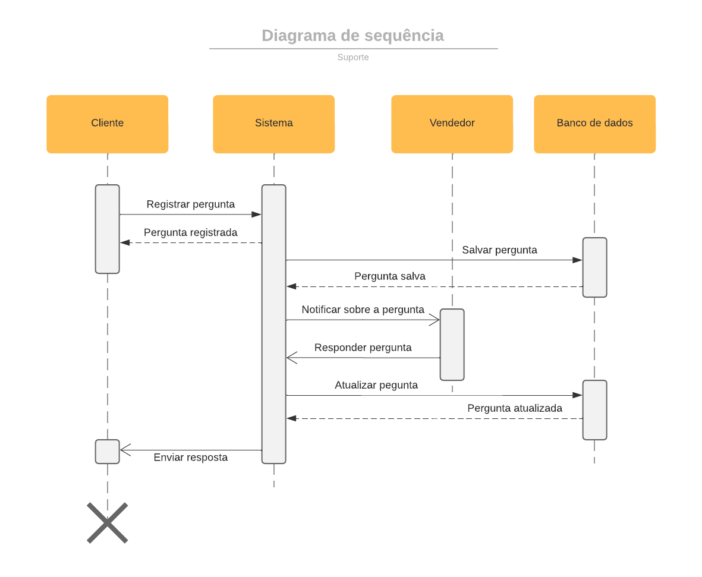
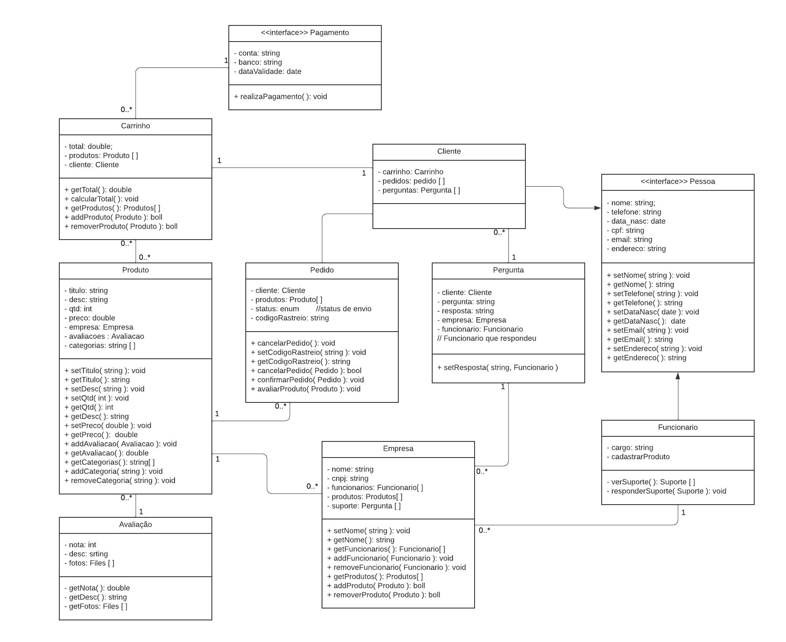

### Visão Geral

Nesta subseção, nomearemos e definiremos as diversas camadas e seu conteúdo, as regras que determinam a inclusão em uma camada específica e as fronteiras entre as camadas. Incluiremos um diagrama de componentes que mostra os relacionamentos entre as camadas.
### Camadas:

#### Camada de Apresentação:
- **Descrição:** Responsável pela interface com o usuário, apresentando informações de forma clara e interativa.
- **Papel no Sistema:** Proporciona uma experiência amigável ao usuário, exibindo e coletando dados por meio da interface gráfica.
- **Principais Componentes:**
    - Módulo de Interface: Gerencia a interação direta com o usuário.
    - Componentes de UI: Elementos visuais que compõem a interface, como páginas, formulários e elementos interativos.
- **Regras:**
    - Todos os elementos visuais e interativos fazem parte desta camada.
    - Lida com a apresentação e coleta de dados sem processamento lógico significativo.

#### Camada de Lógica de Negócios:
- **Descrição:** Concentra as regras de negócios e processamento lógico do sistema.
- **Papel no Sistema:** Realiza o processamento de dados, aplica regras de negócios e coordena a lógica do sistema.
- **Principais Componentes:**
    - Controladores: Gerenciam o fluxo de dados entre a interface e a camada de dados.
    - Serviços de Negócios: Implementam regras específicas do domínio e processamento lógico.
- **Regras:**
    - Responsável pela lógica de negócios e coordenação de processos.
    - Não lida diretamente com a persistência ou manipulação de dados.

#### Camada de Dados:
- **Descrição:** Armazena e gerencia os dados do sistema.
- **Papel no Sistema:** Responsável pelo armazenamento, recuperação e manipulação de dados persistentes.
- **Principais Componentes:**
    - Bancos de Dados: Armazenam dados de usuários, produtos, transações, etc.
    - Repositórios de Dados: Abstraem a interação com os bancos de dados.
- **Regras:**
    - Manipula a persistência e recuperação de dados.
    - Não executa processamento lógico significativo.

### Diagrama de Sequência

Nesta seção, apresentaremos diagramas de sequência que ilustram as interações entre os componentes do sistema em cenários-chave. Esses diagramas destacarão o fluxo de controle e as trocas de mensagens entre os componentes.

- Cadastrar produto

- Comprar produto

- Avaliando produto

- Suporte

### Diagrama de Classes

Aqui, forneceremos um diagrama de classes que descreve a estrutura de classes do sistema, incluindo atributos e métodos. Esse diagrama ajudará a entender a estrutura dos componentes em cada camada e as relações entre eles.

- Diagrama de classes:
